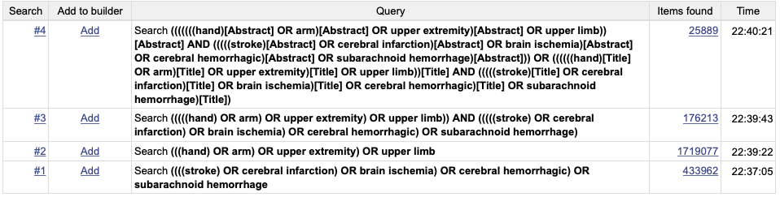

# Data Collectting and Processing

### Data Collecting
download data from pubmed with e-utilities.

#### pre-requests:

    biopython: pip install biopython

<!-- results of search from pubmed central

 -->

#### query term
The number of results searched from pubmed and pmc are not same. The number of pubmed is much smaller than pmc.

We use term

    (((((((hand) OR arm) OR upper extremity) OR upper limb)) AND (((((stroke) OR cerebral infarction) OR brain ischemia) OR cerebral hemorrhagic) OR subarachnoid hemorrhage)))

to search pubmed and PMC and got 16,837 and 176,213 respectively, and use term

    ((((((((hand)[Abstract] OR arm)[Abstract] OR upper extremity)[Abstract] OR upper limb))[Abstract] AND (((((stroke)[Abstract] OR cerebral infarction)[Abstract] OR brain ischemia)[Abstract] OR cerebral hemorrhagic)[Abstract] OR subarachnoid hemorrhage)[Abstract])) OR ((((((hand)[Title] OR arm)[Title] OR upper extremity)[Title] OR upper limb))[Title] AND (((((stroke)[Title] OR cerebral infarction)[Title] OR brain ischemia)[Title] OR cerebral hemorrhagic)[Title] OR subarachnoid hemorrhage)[Title]))

to search pubmed and PMC (only occur in abstract and title) and got 1,169 and 25,889 respectively. These numbers are time sensitive. Our search time is
###### 2019-03-26 11:13 EST+8
. On account of our purpose, we use the first term to build our dataset.

#### data downloading

    python collect_data_from_entrez.py

This script will download data from pubmed and pmc with the first term above by using the biopython module. At the begining of this script, you should declare your email:

    Entrez.email = 'yourmail@mail.com' ### update your mail

This downloading script use the e-utilities to search the databases and download 1000 records in one request.

Results are saved in XML format in ../DATA/pmc_data.txt and ../DATA/pubmed_data.txt. There are 176,161 out of 176,213 records in PMC and 16,814 out of 16,837 records in PUBMED.

### data processing
Since the data are too big to be uploaded to github, we first split the data downloaded to smaller files, and extract doi, title, abstract from the xml files and got 148,350 records.

    python split_extract_data.py

